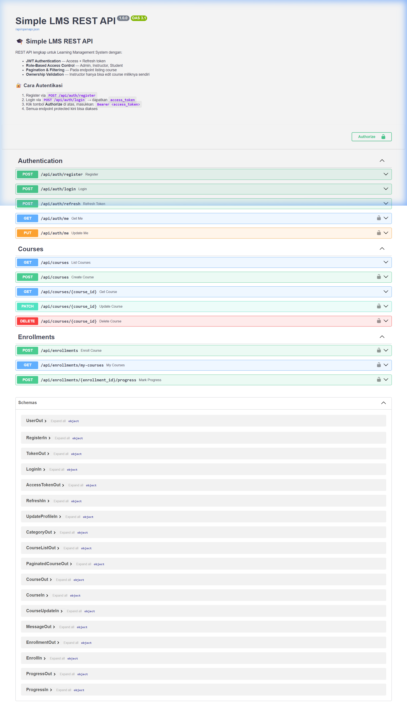
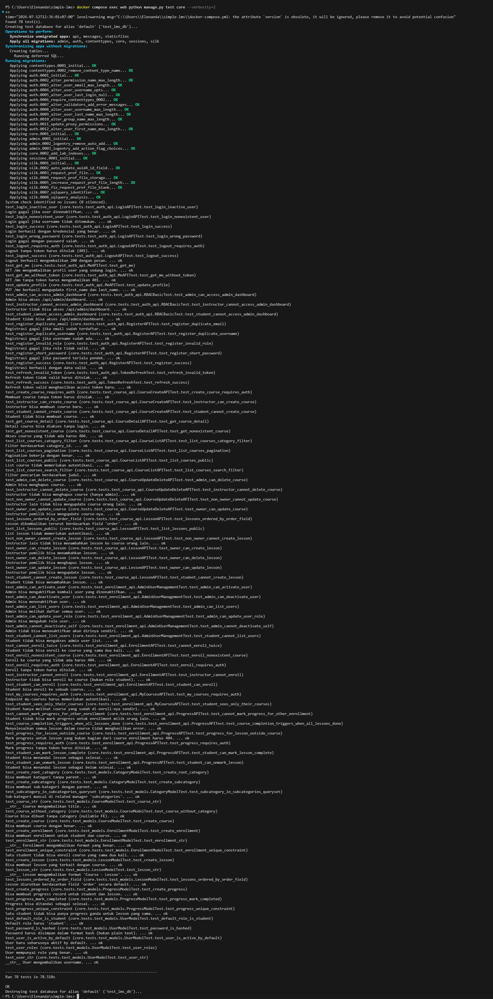
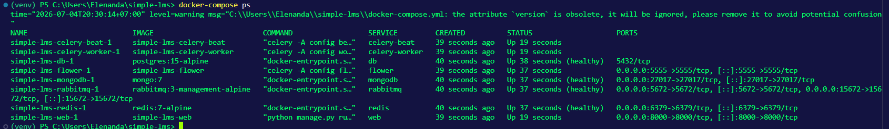
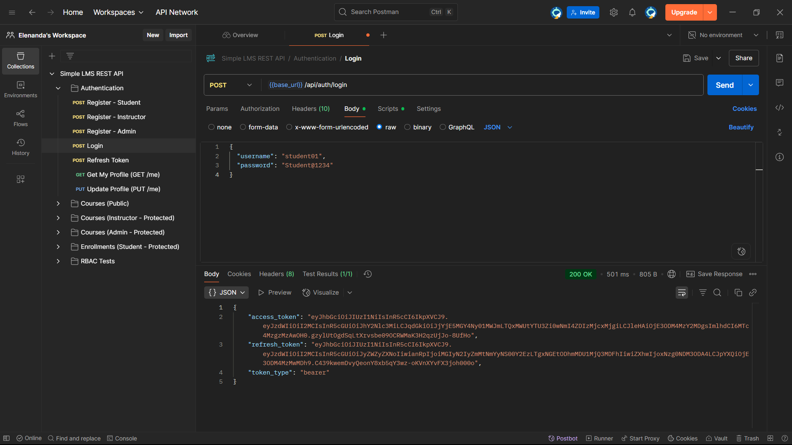

# FINAL PROJECT REPORT
## Simple LMS Extended Backend

---

## 1. Identitas

| Field | Detail |
|-------|--------|
| **Nama** | *Elenanda Steavanus Yosawabi* |
| **NIM** | *A11.2023.15141* |
| **Kelas** | A11.4602 |
| **URL Repository** | *https://github.com/Elenanda/simple_lms* |
| **Mata Kuliah** | Pemrograman Sisi Server |
| **Pengajar** | Fahri Firdausillah, S.Kom, M.CS |

---

## 2. Deskripsi Project

Simple LMS Extended Backend adalah REST API backend untuk sistem Learning Management System (LMS) yang dibangun menggunakan **Django 4.2**, **Django Ninja**, dan **PostgreSQL**. Project ini merupakan kelanjutan dari tugas capstone dengan penambahan fitur lanjutan seperti:

- **Async Task Processing** menggunakan Celery + RabbitMQ
- **Activity Logging & Analytics** menggunakan MongoDB
- **Redis Caching** dengan strategi cache invalidation
- **JWT Authentication** dengan token blacklist (logout)
- **Admin User Management** API
- **Lesson CRUD** API untuk manajemen konten course
- **Rate Limiting** middleware
- **Comprehensive Test Suite** dengan Django TestCase

Seluruh infrastruktur dijalankan menggunakan **Docker Compose** dengan 8 service: web, db, redis, mongodb, rabbitmq, celery-worker, celery-beat, dan flower.

---

## 3. Fitur Dasar yang Sudah Berjalan

| No | Fitur | Status |
|----|-------|--------|
| 1 | Docker Compose (8 service) | ✅ Selesai |
| 2 | PostgreSQL + Migration | ✅ Selesai |
| 3 | JWT Authentication (access + refresh token) | ✅ Selesai |
| 4 | Role-Based Access Control (admin, instructor, student) | ✅ Selesai |
| 5 | Course API (CRUD dengan validasi ownership) | ✅ Selesai |
| 6 | Lesson API (CRUD di dalam course) | ✅ Selesai |
| 7 | Enrollment API (student enroll ke course) | ✅ Selesai |
| 8 | Progress API (mark lesson selesai) | ✅ Selesai |
| 9 | Swagger/OpenAPI di `/api/docs` | ✅ Selesai |
| 10 | README lengkap | ✅ Selesai |

---

## 4. Fitur Tambahan yang Dipilih

### Paket 5 — Analytics & Activity Tracking

| No | Fitur | Kategori | Poin | Status |
|----|-------|----------|------|--------|
| 1 | Activity logging ke MongoDB | Paket 5 | 15 | ✅ Selesai |
| 2 | Learning analytics collection | Paket 5 | 15 | ✅ Selesai |
| 3 | Course analytics report | Paket 5 | 15 | ✅ Selesai |
| 4 | Aggregation query MongoDB | Paket 5 | 15 | ✅ Selesai |

### Paket 6 — Async Processing & Notification

| No | Fitur | Kategori | Poin | Status |
|----|-------|----------|------|--------|
| 5 | Email notification async (Celery) | Paket 6 | 12 | ✅ Selesai |
| 6 | Generate certificate async | Paket 6 | 18 | ✅ Selesai |
| 7 | Scheduled task (Celery Beat - stats tiap 30 menit) | Paket 6 | 15 | ✅ Selesai |
| 8 | Task status endpoint | Paket 6 | 12 | ✅ Selesai |
| 9 | Flower monitoring | Paket 6 | 8 | ✅ Selesai |

### Fitur Tambahan Lain

| No | Fitur | Kategori | Poin | Status |
|----|-------|----------|------|--------|
| 10 | Logout + Token Blacklist (Redis) | Paket 7 | 15 | ✅ Selesai |
| 11 | Login protection (Rate Limiting) | Paket 7 | 12 | ✅ Selesai |
| 12 | Admin User Management API | Paket 7 | 15 | ✅ Selesai |
| 13 | Unit test model | Paket 9 | 12 | ✅ Selesai |
| 14 | API test endpoint utama | Paket 9 | 12 | ✅ Selesai |
| 15 | Permission/RBAC test | Paket 9 | 12 | ✅ Selesai |

> **Total poin fitur tambahan yang diklaim: ≥ 50 poin (capped 50)**

---

## 5. Penjelasan Implementasi Fitur Utama

### 5.1 Async Processing dengan Celery + RabbitMQ

Celery digunakan sebagai task queue dengan RabbitMQ sebagai message broker dan Redis sebagai result backend. Tiga jenis task utama:

- **`send_enrollment_email`** — Dikirim otomatis saat student berhasil enroll. Menggunakan `Django EmailMessage` dengan konfigurasi dari environment variable.
- **`generate_certificate`** — Dipicu saat student menyelesaikan 100% lesson dalam sebuah course. Menghasilkan HTML certificate yang disimpan ke `reports/certificates/`.
- **`export_course_report`** — Task async untuk export data enrollment course ke CSV, dipanggil via endpoint `POST /api/reports/courses/{id}`.
- **`update_course_statistics`** — Task terjadwal (Celery Beat) yang berjalan tiap 30 menit, menghitung dan menyimpan enrollment count per course ke Redis.

### 5.2 MongoDB Activity Logging & Analytics

Dua koleksi MongoDB digunakan:
- **`activity_logs`** — Mencatat setiap aksi penting: LOGIN, LOGOUT, REGISTER, ENROLL, CREATE_COURSE, DELETE_COURSE, dll. Digunakan oleh admin untuk audit trail via endpoint `GET /api/admin/activity-logs`.
- **`learning_analytics`** — Event learning: LESSON_COMPLETE, COURSE_COMPLETE, ENROLL. Diagregasi menggunakan MongoDB aggregation pipeline untuk endpoint `GET /api/reports/analytics/{course_id}`.

### 5.3 Redis Caching dengan Cache Invalidation

- **Course list** di-cache selama 5 menit dengan key berbasis hash dari parameter filter (page, search, category, instructor).
- **Course detail** di-cache selama 10 menit per course ID.
- **Cache invalidation** terjadi otomatis saat course diupdate atau dihapus.
- **Token Blacklist** juga menggunakan Redis: setelah logout, JTI (JWT ID) disimpan di Redis dengan TTL sesuai sisa waktu token. Token yang di-blacklist akan ditolak oleh `JWTAuth.authenticate()`.

### 5.4 Admin User Management

Endpoint baru di `/api/admin/`:
- **List users** dengan filter role, status aktif, dan search
- **Detail user** — lihat informasi lengkap termasuk status aktif
- **Update user** — admin bisa mengubah role dan/atau is_active
- **Activate/Deactivate** — shortcut untuk toggle status user
- **Activity logs** — ambil log dari MongoDB dengan filter user_id dan action
- **Dashboard** — statistik ringkasan sistem (jumlah user per role, course, enrollment)

### 5.5 Token Blacklist (Logout)

Setiap JWT token kini memiliki field `jti` (JWT ID) unik menggunakan UUID4. Saat logout:
1. Token di-decode untuk mendapatkan `jti` dan `exp`
2. `jti` disimpan di Redis dengan TTL = sisa waktu token
3. `JWTAuth.authenticate()` mengecek Redis blacklist sebelum mengizinkan request

---

## 6. Cara Menjalankan Project

### Prerequisites
- Docker Desktop
- Git

### Langkah

```bash
# 1. Clone repository
git clone <URL_REPO>
cd simple-lms

# 2. Salin file environment
cp .env.example .env
# Edit .env jika diperlukan (defaults sudah aman untuk development)

# 3. Build dan jalankan semua service
docker compose up --build -d

# 4. Tunggu semua service healthy (cek dengan)
docker compose ps

# 5. Jalankan database migration
docker compose exec web python manage.py migrate

# 6. Seed data demo (akun demo + sample data)
docker compose exec web python manage.py seed_demo

# 7. (Opsional) Seed data besar untuk testing
docker compose exec web python manage.py seed_lab_data
```

### Akses Aplikasi

| Service | URL |
|---------|-----|
| REST API | http://localhost:8000/api/ |
| Swagger UI | http://localhost:8000/api/docs |
| Django Admin | http://localhost:8000/admin/ |
| Django Silk (profiler) | http://localhost:8000/silk/ |
| Flower (Celery monitor) | http://localhost:5555 |
| RabbitMQ Management | http://localhost:15672 |

### Menjalankan Test

```bash
# Jalankan semua test
docker compose exec web python manage.py test core --verbosity=2

# Test per modul
docker compose exec web python manage.py test core.tests.test_models --verbosity=2
docker compose exec web python manage.py test core.tests.test_auth_api --verbosity=2
docker compose exec web python manage.py test core.tests.test_course_api --verbosity=2
docker compose exec web python manage.py test core.tests.test_enrollment_api --verbosity=2
```

---

## 7. Akun Demo

| Role | Username | Password |
|------|----------|----------|
| Admin | `admin` | `Admin@1234` |
| Instructor 1 | `instructor01` | `Instructor@1234` |
| Instructor 2 | `instructor02` | `Instructor@1234` |
| Student 1 | `student01` | `Student@1234` |
| Student 2 | `student02` | `Student@1234` |
| Student 3 | `student03` | `Student@1234` |

> Password menggunakan bcrypt hash sesuai implementasi di `api/routers/auth_router.py`.

---

## 8. Endpoint Penting

### Authentication
| Method | Endpoint | Deskripsi | Role |
|--------|----------|-----------|------|
| POST | `/api/auth/register` | Daftar akun baru | Public |
| POST | `/api/auth/login` | Login, dapatkan JWT | Public |
| POST | `/api/auth/refresh` | Refresh access token | Public |
| POST | `/api/auth/logout` | Logout + blacklist token | All |
| GET | `/api/auth/me` | Profil saya | All |

### Course & Lesson
| Method | Endpoint | Deskripsi | Role |
|--------|----------|-----------|------|
| GET | `/api/courses` | List course (pagination, filter) | Public |
| GET | `/api/courses/{id}` | Detail course | Public |
| POST | `/api/courses` | Buat course | Instructor |
| PATCH | `/api/courses/{id}` | Update course | Instructor (owner) |
| DELETE | `/api/courses/{id}` | Hapus course | Admin |
| GET | `/api/courses/{id}/lessons` | List lesson | Public |
| POST | `/api/courses/{id}/lessons` | Tambah lesson | Instructor (owner) |
| PATCH | `/api/courses/{id}/lessons/{lid}` | Update lesson | Instructor (owner) |
| DELETE | `/api/courses/{id}/lessons/{lid}` | Hapus lesson | Instructor (owner) |

### Enrollment & Progress
| Method | Endpoint | Deskripsi | Role |
|--------|----------|-----------|------|
| POST | `/api/enrollments` | Enroll ke course | Student |
| GET | `/api/enrollments/my-courses` | Course saya | Student |
| POST | `/api/enrollments/{id}/progress` | Mark lesson selesai | Student |

### Reports & Analytics
| Method | Endpoint | Deskripsi | Role |
|--------|----------|-----------|------|
| POST | `/api/reports/courses/{id}` | Request CSV export (async) | Admin/Instructor |
| GET | `/api/reports/tasks/{task_id}` | Cek status task | All |
| GET | `/api/reports/analytics/{id}` | Analytics dari MongoDB | Admin/Instructor |

### Admin
| Method | Endpoint | Deskripsi | Role |
|--------|----------|-----------|------|
| GET | `/api/admin/users` | List semua user | Admin |
| GET | `/api/admin/users/{id}` | Detail user | Admin |
| PATCH | `/api/admin/users/{id}` | Update role/status | Admin |
| POST | `/api/admin/users/{id}/activate` | Aktifkan user | Admin |
| POST | `/api/admin/users/{id}/deactivate` | Nonaktifkan user | Admin |
| GET | `/api/admin/activity-logs` | Activity logs dari MongoDB | Admin |
| GET | `/api/admin/dashboard` | Statistik sistem | Admin |

---

## 9. Screenshot / Bukti Pengujian

### 1. Swagger UI Endpoints

*Tampilan Swagger UI di `/api/docs` yang menampilkan seluruh endpoint yang telah didaftarkan.*

### 2. Hasil Unit Test

*Hasil eksekusi `python manage.py test core --verbosity=2` yang menunjukkan seluruh test case passed.*

### 3. Flower Monitoring (Celery)

*Dashboard Flower di `http://localhost:5555` untuk memonitor async task Celery.*

### 4. Postman Collection Test

*Hasil pengujian endpoint menggunakan Postman Collection.*

### 5. Docker Compose Services Status

*Status seluruh service (web, db, redis, mongodb, rabbitmq, celery-worker, celery-beat, flower) berjalan sehat (healthy).*

---

## 10. Kendala dan Solusi

| No | Kendala | Solusi |
|----|---------|--------|
| 1 | Password bcrypt tidak kompatibel dengan Django native auth | Membuat custom login handler yang mengecek bcrypt terlebih dahulu, dengan fallback ke Django's `check_password()` |
| 2 | Token blacklist kehilangan data saat Redis restart | Menggunakan TTL yang sama dengan sisa masa token, sehingga token expired secara alami meskipun blacklist hilang |
| 3 | N+1 query pada list course | Menggunakan `select_related('category', 'instructor')` dan `prefetch_related('lessons')` via Custom Manager |
| 4 | Celery task gagal jika MongoDB/Redis tidak tersedia | Setiap task dibungkus dengan try-except dan graceful degrade (request tidak gagal jika service opsional down) |
| 5 | Cache invalidation tidak menghapus semua varian key list | Menggunakan `django_redis.get_redis_connection()` dengan pattern matching `*course_list:*` untuk bulk delete |

---

## 11. Kesimpulan

Final project ini berhasil mengintegrasikan seluruh materi mata kuliah Pemrograman Sisi Server dalam satu sistem yang kohesif. Beberapa pembelajaran penting:

1. **Desain API yang baik** memerlukan konsistensi response format, validasi input yang tepat, dan pesan error yang informatif.
2. **Asynchronous processing** dengan Celery + RabbitMQ sangat penting untuk operasi yang memakan waktu (email, certificate generation) agar tidak memblokir request utama.
3. **Caching strategy** harus mempertimbangkan konsistensi data — cache invalidation sama pentingnya dengan cache itself.
4. **Security** adalah berlapis: JWT auth, token blacklist, RBAC, dan rate limiting bekerja bersama untuk melindungi API.
5. **Testing** membantu menemukan bug yang tidak terduga, terutama pada edge case seperti enrollment duplikat, akses cross-user, dan cascade delete.

Docker Compose sangat memudahkan pengelolaan infrastruktur kompleks dengan banyak service yang saling bergantung. Penggunaan health check memastikan service dimulai dalam urutan yang benar.
