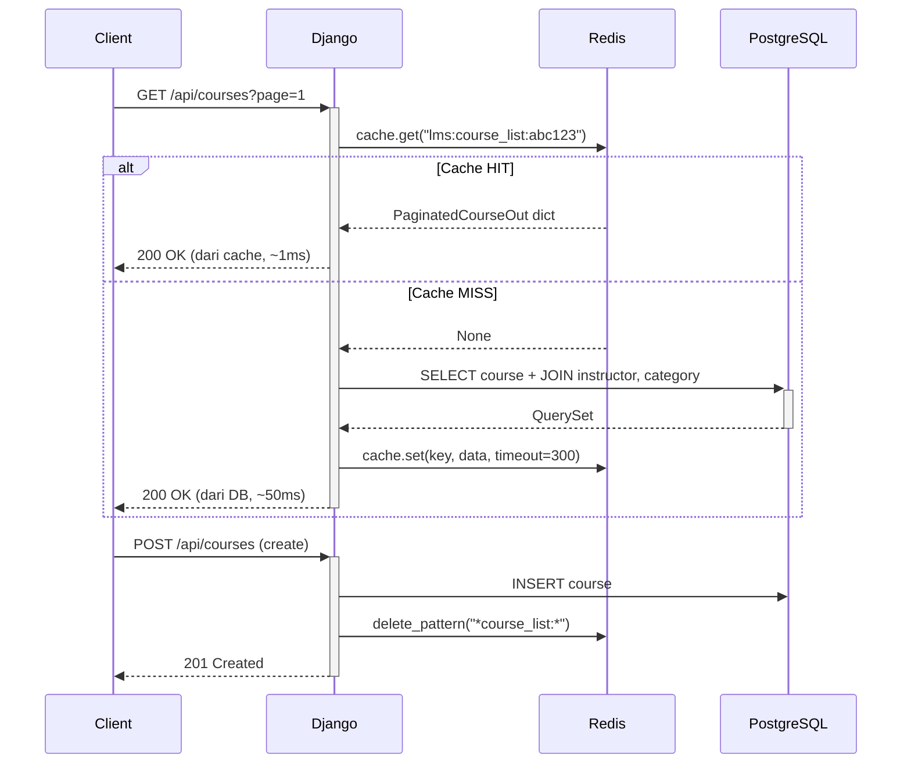
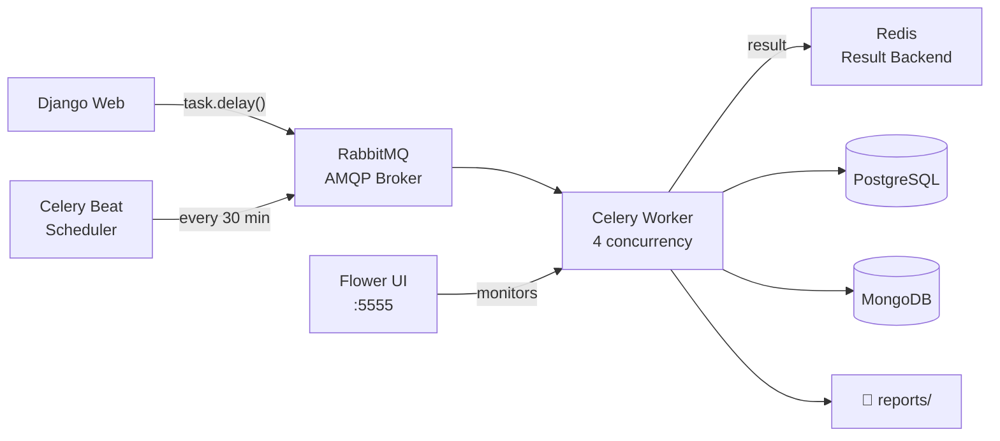

# 🎓 Simple LMS — Django REST API Project

Sistem manajemen pembelajaran (LMS) berbasis **Django 4.2**, lengkap dengan **REST API (Django Ninja)**, **JWT Authentication**, **Role-Based Access Control (RBAC)**, **Redis Caching** (API + standalone lab), **MongoDB Logging**, **Celery Async Tasks**, dan **Query Optimization**.

> **Progress:** Modul 1 (Docker + Models) → Modul 2 (REST API + JWT + RBAC) → Modul 3 (Redis + MongoDB + Celery) → **Modul 4 (Redis Caching Lab ✅)**

---

## 📑 Daftar Isi

1. [Tech Stack](#tech-stack)
2. [Arsitektur Project](#arsitektur-project)
3. [Data Models](#data-models--relasi)
4. [REST API — Endpoint Lengkap](#rest-api--endpoint-lengkap)
5. [Authentication System (JWT)](#authentication-system-jwt)
6. [Role-Based Access Control (RBAC)](#role-based-access-control-rbac)
7. [Pydantic Schemas](#pydantic-schemas)
8. [Redis Caching (Django)](#redis-caching)
9. [Rate Limiting](#rate-limiting)
10. [MongoDB Activity Logs](#mongodb-activity-logs)
11. [Celery Async Tasks](#celery-async-tasks)
12. [Query Optimization](#query-optimization)
13. [Swagger UI Documentation](#swagger-ui-documentation)
14. [Docker Setup](#docker-setup)
15. [Cara Menjalankan Project](#cara-menjalankan-project)
16. [Environment Variables](#environment-variables)
17. [Postman Collection](#postman-collection)
18. [Redis Caching Lab (Standalone)](#redis-caching-lab-standalone)
19. [Deliverables Summary](#deliverables-summary)

---

## Tech Stack

| Teknologi | Versi | Fungsi |
|---|---|---|
| Django | 4.2.11 | Web framework |
| Django Ninja | 1.6.2 | REST API + Swagger UI |
| PyJWT | 2.9.0 | JWT token generation & validation |
| bcrypt | 4.2.0 | Password hashing |
| email-validator | 2.3.0 | Pydantic EmailStr support |
| **redis** | **5.0.8** | **Cache client (Python)** |
| **django-redis** | **5.4.0** | **Django cache backend via Redis** |
| **pymongo** | **4.7.3** | **MongoDB driver (activity logs)** |
| **celery** | **5.3.6** | **Async task queue** |
| **flower** | **2.0.1** | **Celery monitoring UI** |
| PostgreSQL | 15 | Database produksi (via Docker) |
| SQLite | bawaan | Database dev lokal |
| RabbitMQ | 3 | Message broker untuk Celery |
| MongoDB | 7 | Document store (logs & analytics) |
| Django Silk | 5.5.0 | Query profiling |
| Docker + Docker Compose | — | Containerisasi (8 services) |

---

## Arsitektur Project

```
simple-lms/
├── config/
│   ├── settings.py          # Django settings + JWT config + DB auto-detect
│   ├── urls.py              # Root URL: /api/ → Ninja, /courses/ → core, /silk/
│   └── wsgi.py
├── core/
│   ├── models.py            # 6 Models: User, Category, Course, Lesson, Enrollment, Progress
│   ├── admin.py             # Django Admin config (TabularInline, list_display, dll)
│   ├── views.py             # Lab endpoints: baseline vs optimized
│   ├── urls.py              # /courses/lab/* routes
│   └── fixtures/
│       └── initial_data.json
├── api/
│   ├── main.py              # NinjaAPI instance — Swagger di /api/docs
│   ├── auth.py              # JWTAuth backend + role decorators
│   ├── schemas.py           # 16 Pydantic schemas
│   └── routers/
│       ├── auth_router.py       # /api/auth/* (5 endpoints)
│       ├── course_router.py     # /api/courses/* (5 endpoints)
│       └── enrollment_router.py # /api/enrollments/* (3 endpoints)
├── requirements.txt
├── docker-compose.yml
├── Dockerfile
└── simple_lms_api.postman_collection.json
```

---

## Data Models & Relasi

Diimplementasikan **6 model utama** di `core/models.py`:

### Diagram Relasi

```
User (AbstractUser + role)
 ├─[instructor]─► Course ──► Category (self-referencing)
 │                  └──► Lesson (ordered)
 └─[student]──► Enrollment ──► Course
                    └──► Progress ──► Lesson
```

### Detail Model

| Model | Relasi Utama | Fitur Khusus |
|---|---|---|
| `User` | — | `role` field: admin/instructor/student |
| `Category` | Self FK (`parent`) | Hierarki sub-kategori |
| `Course` | FK User (instructor), FK Category | Custom Manager, DB Index komposit |
| `Lesson` | FK Course | `Meta ordering` by `order` |
| `Enrollment` | FK User (student), FK Course | `unique_together` (student, course) |
| `Progress` | FK User, FK Lesson | Track `is_completed` + `completed_at` |

### Custom Model Managers

```python
# core/models.py
class CourseManager(models.Manager):
    def for_listing(self):
        return self.get_queryset().select_related('category', 'instructor') \
                                  .prefetch_related('lessons')

class EnrollmentManager(models.Manager):
    def for_student_dashboard(self):
        return self.get_queryset().select_related('course', 'course__category')
```

---

## REST API — Endpoint Lengkap

Base URL: `http://127.0.0.1:8000/api`  
Swagger UI: **http://127.0.0.1:8000/api/docs**

### 🔐 Authentication (`/api/auth`)

| Method | Endpoint | Akses | Deskripsi |
|---|---|---|---|
| `POST` | `/auth/register` | Public | Daftarkan user baru |
| `POST` | `/auth/login` | Public | Login → JWT access + refresh token |
| `POST` | `/auth/refresh` | Public | Tukar refresh token → access token baru |
| `GET` | `/auth/me` | 🔒 Any | Profil user yang sedang login |
| `PUT` | `/auth/me` | 🔒 Any | Update profil (nama, email) |

### 📚 Courses (`/api/courses`)

| Method | Endpoint | Akses | Deskripsi |
|---|---|---|---|
| `GET` | `/courses` | Public | List courses (pagination + filter) |
| `GET` | `/courses/{id}` | Public | Detail course + enrollment count |
| `POST` | `/courses` | 🔒 Instructor | Buat course baru |
| `PATCH` | `/courses/{id}` | 🔒 Instructor (owner) | Update course milik sendiri |
| `DELETE` | `/courses/{id}` | 🔒 Admin | Hapus course |

**Query Parameters `GET /courses`:**
```
page         = 1        (default, min: 1)
page_size    = 10       (default, max: 100)
search       = "python" (filter judul, case-insensitive)
category_id  = 2        (filter by kategori)
instructor_id= 5        (filter by instruktur)
```

### 📋 Enrollments (`/api/enrollments`)

| Method | Endpoint | Akses | Deskripsi |
|---|---|---|---|
| `POST` | `/enrollments` | 🔒 Student | Enroll ke course |
| `GET` | `/enrollments/my-courses` | 🔒 Student | Daftar course yang diikuti |
| `POST` | `/enrollments/{id}/progress` | 🔒 Student | Tandai lesson selesai/belum |

---

## Authentication System (JWT)

### Flow Diagram

```
POST /api/auth/login
  └─► bcrypt.checkpw(password, hash)
      └─► create_access_token(user_id)   [exp: 60 menit, HS256]
          create_refresh_token(user_id)  [exp: 7 hari, HS256]
              └─► Response: { access_token, refresh_token }

Protected Request:
  Header: Authorization: Bearer <access_token>
      └─► JWTAuth.authenticate()
          └─► jwt.decode(token, SECRET_KEY)
              └─► User.objects.get(pk=sub)
                  └─► request.auth = user ✅
```

### Token Payload

```json
// Access Token (exp: +1 jam)
{ "sub": "42", "type": "access", "exp": 1720000000, "iat": 1719996400 }

// Refresh Token (exp: +7 hari)
{ "sub": "42", "type": "refresh", "exp": 1720600000, "iat": 1719996400 }
```

### Password Hashing

```python
# Register — hash dengan bcrypt
hashed = bcrypt.hashpw(data.password.encode(), bcrypt.gensalt()).decode()

# Login — verifikasi
if not bcrypt.checkpw(data.password.encode(), user.password.encode()):
    if not user.check_password(data.password):   # fallback Django native
        raise HttpError(401, "Username atau password salah.")
```

---

## Role-Based Access Control (RBAC)

### Role Decorators (`api/auth.py`)

```python
is_admin               = _role_required("admin")
is_instructor          = _role_required("instructor")
is_student             = _role_required("student")
is_admin_or_instructor = _role_required("admin", "instructor")
```

### Permission Matrix

| Endpoint | Public | Student | Instructor | Admin |
|---|:---:|:---:|:---:|:---:|
| `GET /api/courses` | ✅ | ✅ | ✅ | ✅ |
| `GET /api/courses/{id}` | ✅ | ✅ | ✅ | ✅ |
| `POST /api/courses` | ❌ | ❌ | ✅ | ❌ |
| `PATCH /api/courses/{id}` | ❌ | ❌ | ✅ (owner) | ❌ |
| `DELETE /api/courses/{id}` | ❌ | ❌ | ❌ | ✅ |
| `POST /api/enrollments` | ❌ | ✅ | ❌ | ❌ |
| `GET /api/enrollments/my-courses` | ❌ | ✅ | ❌ | ❌ |
| `POST /api/enrollments/{id}/progress` | ❌ | ✅ | ❌ | ❌ |

### Ownership Validation

Selain role check, instructor hanya bisa mengedit **course miliknya sendiri**:

```python
@router.patch("/{course_id}", auth=jwt_auth)
@is_instructor
def update_course(request, course_id, data):
    course = Course.objects.get(pk=course_id)
    if course.instructor_id != request.auth.pk:
        raise HttpError(403, "Anda bukan pemilik course ini.")
```

---

## Pydantic Schemas

Seluruh schema didefinisikan di `api/schemas.py` menggunakan **Pydantic v2**:

| Schema | Digunakan pada |
|---|---|
| `RegisterIn` | `POST /auth/register` — validasi role, EmailStr, min_length |
| `LoginIn` | `POST /auth/login` |
| `TokenOut` | Response login (access + refresh token) |
| `RefreshIn` / `AccessTokenOut` | `POST /auth/refresh` |
| `UserOut` | Response profil user |
| `UpdateProfileIn` | `PUT /auth/me` — semua field optional |
| `CourseIn` | `POST /courses` — title min 3 char, description min 10 char |
| `CourseUpdateIn` | `PATCH /courses/{id}` — semua field optional |
| `CourseOut` / `CourseListOut` | Response detail & list course |
| `PaginatedCourseOut` | Response list course dengan pagination |
| `CategoryOut` | Nested dalam CourseOut |
| `EnrollIn` | `POST /enrollments` |
| `EnrollmentOut` | Response enrollment |
| `ProgressIn` / `ProgressOut` | `POST /enrollments/{id}/progress` |
| `TaskStatusOut` | Response status Celery task |
| `CourseAnalyticsOut` | Response MongoDB aggregation |

---

## Redis Caching

### Strategi Caching

| Endpoint | Cache Key | TTL | Invalidasi |
|---|---|---|---|
| `GET /api/courses` | `lms:course_list:{hash_params}` | 5 menit | Saat create/update/delete course |
| `GET /api/courses/{id}` | `lms:course_detail:{id}` | 10 menit | Saat update/delete course tersebut |

### Flow Diagram



### Cache Invalidation (`services/cache.py`)

```python
# Setelah create / update / delete course:
course_cache.invalidate_all_course_lists()  # hapus semua list cache
course_cache.invalidate_course_detail(id)   # hapus detail cache satu course
```

---

## Rate Limiting

Diimplementasikan sebagai **Django Middleware** menggunakan **Redis counter**.

- **Limit**: 60 requests per menit per IP address
- **Algoritma**: Sliding window counter
- **Exempt**: `/api/docs`, `/admin/`, `/silk/`
- **Response 429**: Jika limit terlampaui

```json
// Response HTTP 429
{
  "detail": "Rate limit exceeded.",
  "limit": 60,
  "window": "60s",
  "retry_after": 42
}
```

### Redis CLI — Monitoring Rate Limit

```bash
# Lihat semua rate limit keys aktif
docker exec -it simple-lms-redis-1 redis-cli KEYS "lms:rl:*"

# Lihat count untuk IP tertentu
docker exec -it simple-lms-redis-1 redis-cli GET "lms:rl:127.0.0.1:28483719"

# Lihat semua course list cache keys
docker exec -it simple-lms-redis-1 redis-cli KEYS "lms:course_list:*"

# Hapus semua cache (manual)
docker exec -it simple-lms-redis-1 redis-cli FLUSHDB

# Monitor real-time commands
docker exec -it simple-lms-redis-1 redis-cli MONITOR
```

---

## MongoDB Activity Logs

### Collections

| Collection | Tujuan | Contoh Dokumen |
|---|---|---|
| `activity_logs` | Setiap aksi user (login, create, enroll) | `{user_id, action, resource_type, timestamp}` |
| `learning_analytics` | Event belajar (progress, course complete) | `{event_type, course_id, student_id, timestamp}` |

### Events yang Dicatat

| Event | Trigger | Collection |
|---|---|---|
| `LOGIN` | `POST /api/auth/login` | activity_logs |
| `REGISTER` | `POST /api/auth/register` | activity_logs |
| `CREATE_COURSE` | `POST /api/courses` | activity_logs |
| `UPDATE_COURSE` | `PATCH /api/courses/{id}` | activity_logs |
| `DELETE_COURSE` | `DELETE /api/courses/{id}` | activity_logs |
| `ENROLL` | `POST /api/enrollments` | activity_logs + learning_analytics |
| `LESSON_COMPLETE` | `POST /api/enrollments/{id}/progress` | learning_analytics |
| `COURSE_COMPLETE` | Semua lesson selesai | learning_analytics |
| `EXPORT_REPORT` | `POST /api/reports/courses/{id}` | activity_logs |

### Aggregation Query — Analytics Report

```python
# services/mongodb.py — get_course_activity_summary(course_id)
pipeline = [
    {"$match": {"course_id": course_id}},
    {"$group": {
        "_id": "$event_type",
        "count": {"$sum": 1},
        "unique_students": {"$addToSet": "$student_id"},
    }},
    {"$project": {
        "event_type": "$_id",
        "count": 1,
        "unique_student_count": {"$size": "$unique_students"},
    }},
]
```

**Akses via API**: `GET /api/reports/analytics/{course_id}` (Admin/Instructor)

---

## Celery Async Tasks

### Architecture



### Task List

| Task | Modul | Trigger | Output |
|---|---|---|---|
| `send_enrollment_email` | `tasks/email_tasks.py` | `POST /api/enrollments` | Email ke student |
| `generate_certificate` | `tasks/certificate_tasks.py` | Semua lesson selesai | HTML certificate di `reports/certificates/` |
| `update_course_statistics` | `tasks/stats_tasks.py` | **Setiap 30 menit** (Beat) | Enrollment count di Redis |
| `export_course_report` | `tasks/report_tasks.py` | `POST /api/reports/courses/{id}` | CSV di `reports/exports/` |

### Async CSV Export Flow

```
POST /api/reports/courses/5
  └─► export_course_report.delay(course_id=5, user_id=1)
      └─► Response 202: { "task_id": "abc-123", "status": "PENDING" }

GET /api/reports/tasks/abc-123
  └─► AsyncResult("abc-123").status
      └─► Response: { "task_id": "abc-123", "status": "SUCCESS",
                      "result": { "file": "course_5_report_20250429.csv", "rows": 48 } }
```

### Flower Monitoring

Akses Celery monitoring UI di: **http://localhost:5555**

Menampilkan:
- Active workers dan concurrency
- Task history (SUCCESS / FAILURE / RETRY)
- Real-time task throughput
- Worker resource usage

---

## Query Optimization


### Lab Endpoints (`/courses/lab/`)

Tersedia 3 pasang endpoint untuk membandingkan performa query sebelum dan sesudah optimasi:

| Endpoint | Masalah | Solusi |
|---|---|---|
| `/lab/course-list/baseline/` | N+1: 1 query/instruktur | `select_related('instructor', 'category')` |
| `/lab/course-members/baseline/` | N+1 reverse FK | `annotate(Count) + prefetch_related` |
| `/lab/course-dashboard/baseline/` | Loop Python untuk statistik | `aggregate / annotate` |

### Hasil Pengujian

- **Unoptimized**: **7 Queries** untuk 3 Course (N+1 Problem)
- **Optimized**: **2 Queries** (SQL JOIN via `select_related`)
- **Efisiensi**: Pengurangan ~71% jumlah query database

**Bukti Eksekusi Terminal:**


### Django Silk Profiling

Tersedia di **http://127.0.0.1:8000/silk/** — merekam 100% request beserta SQL query dan waktu eksekusi.

---

## Swagger UI Documentation

Swagger UI otomatis di-generate oleh Django Ninja dan dapat diakses di:

**➡️ http://127.0.0.1:8000/api/docs**

### Screenshot Swagger UI


### Cara Autentikasi di Swagger

1. Register via `POST /api/auth/register`
2. Login via `POST /api/auth/login` → salin `access_token` dari response
3. Klik tombol **🔒 Authorize** di pojok kanan atas Swagger
4. Masukkan: `Bearer <access_token>`
5. Semua endpoint protected kini bisa ditest langsung

---

## Cara Menjalankan Project

### A. Development Lokal (SQLite, tanpa Docker)

```bash
# 1. Clone repository
git clone https://github.com/Elenanda/simple_lms.git
cd simple_lms

# 2. Buat & aktifkan virtual environment
python -m venv venv
venv\Scripts\activate          # Windows
# source venv/bin/activate     # Linux/Mac

# 3. Install dependencies
pip install -r requirements.txt

# 4. Jalankan migrasi
python manage.py migrate

# 5. (Opsional) Load data awal
python manage.py loaddata core/fixtures/initial_data.json

# 6. Buat superuser (role: admin)
python manage.py createsuperuser

# 7. Jalankan server
python manage.py runserver
```

**Akses:**
- Swagger API Docs: http://127.0.0.1:8000/api/docs
- Django Admin: http://127.0.0.1:8000/admin
- Silk Profiler: http://127.0.0.1:8000/silk

### B. Quick Test via cURL

```bash
# Register instructor
curl -X POST http://127.0.0.1:8000/api/auth/register \
  -H "Content-Type: application/json" \
  -d '{"username":"instr1","email":"i@test.com","password":"pass1234","role":"instructor"}'

# Login → dapatkan access_token
curl -X POST http://127.0.0.1:8000/api/auth/login \
  -H "Content-Type: application/json" \
  -d '{"username":"instr1","password":"pass1234"}'

# Buat course (sebagai instructor)
curl -X POST http://127.0.0.1:8000/api/courses \
  -H "Authorization: Bearer <access_token>" \
  -H "Content-Type: application/json" \
  -d '{"title":"Intro to Python","description":"Belajar Python dari dasar hingga OOP"}'

# List courses (publik, dengan pagination)
curl "http://127.0.0.1:8000/api/courses?page=1&page_size=5&search=python"
```

---

## Docker Setup

### Prasyarat

- Docker Desktop / Docker Engine terinstall
- Git

### Menjalankan dengan Docker

```bash
# 1. Salin file env
cp .env.example .env

# 2. Build dan jalankan semua container
docker-compose up --build -d

# 3. Jalankan migrasi di dalam container
docker-compose exec web python manage.py migrate

# 4. (Opsional) Buat superuser
docker-compose exec web python manage.py createsuperuser

# 5. Buka http://localhost:8000
```

### Status Container

**Status Container (Docker Compose):**


**Database Logs & Connection:**


---

## Environment Variables

Salin `.env.example` menjadi `.env` dan sesuaikan:

```env
SECRET_KEY=your-very-secret-key-here
DEBUG=True

DB_NAME=simple_lms_db
DB_USER=lms_user
DB_PASSWORD=lms_password
DB_HOST=db
DB_PORT=5432
```

| Variable | Deskripsi |
|---|---|
| `SECRET_KEY` | Kunci rahasia Django (digunakan juga untuk signing JWT) |
| `DEBUG` | Mode development: `True` / `False` |
| `DB_HOST` | Jika di-set → gunakan PostgreSQL; jika kosong → SQLite |
| `DB_NAME` / `DB_USER` / `DB_PASSWORD` | Kredensial PostgreSQL |

> **Catatan:** Jika `DB_HOST` tidak di-set, project otomatis menggunakan SQLite untuk development lokal.

---

## Postman Collection

File collection tersedia di root project: **`simple_lms_api.postman_collection.json`**

### Import ke Postman

1. Buka Postman → **Import** → Upload File
2. Pilih `simple_lms_api.postman_collection.json`
3. Set environment variable: `base_url = http://127.0.0.1:8000`
4. Jalankan request **"Login"** → copy nilai `access_token`
5. Set environment variable: `token = <access_token>`
6. Semua request protected sudah otomatis menggunakan token

---

## Screenshots

### Django Admin Interface


### Setup Environment

**Halaman Welcome Django (Localhost:8000):**


---

## 📊 Project Summary

| Metrik | Nilai |
|---|---|
| Total API Endpoints | **16** (13 core + 3 reports) |
| Pydantic Schemas | **18** |
| Django Models | **6** |
| Role Decorators | **4** (`is_admin`, `is_instructor`, `is_student`, `is_admin_or_instructor`) |
| Lab Query Endpoints | **6** (3 baseline + 3 optimized) |
| Query Reduction | **~71%** (7 queries → 2 queries) |
| Token Expiry (Access) | **60 menit** |
| Token Expiry (Refresh) | **7 hari** |
| Redis Cache TTL (Course List) | **5 menit** |
| Redis Cache TTL (Course Detail) | **10 menit** |
| Rate Limit | **60 req/menit per IP** |
| Celery Tasks | **4** (email, certificate, stats, CSV export) |
| Docker Services | **8** (web, db, redis, mongodb, rabbitmq, worker, beat, flower) |
| Redis Cache Speed-up (Lab) | **~1003x** (2.003s → 0.002s) |

---

## Redis Caching Lab (Standalone)

Lab mandiri yang mendemonstrasikan konsep Redis caching dari nol, **terpisah dari Django framework**.

### Lokasi File

```
redis_lab/
├── weather_api.py     # Implementasi get_weather() dengan Redis cache
├── test_cache.py      # Testing script 4 skenario + demo Redis commands
└── cache_report.md    # Dokumentasi lengkap + jawaban refleksi
```

### Skenario

```python
# SEBELUM (tanpa cache) — selalu 2 detik
def get_weather(city):
    time.sleep(2)  # Simulate slow API
    return requests.get(f"https://api.example.com/weather/{city}").json()

# SESUDAH (dengan Redis cache) — hanya 2 detik pada first call
def get_weather(city: str) -> dict:
    cache_key = f"weather:{city.lower()}"

    cached = redis_client.get(cache_key)        # Redis: GET
    if cached:
        return json.loads(cached)               # CACHE HIT: < 0.002s

    data = _fetch_from_api(city)                # CACHE MISS: ~2s
    redis_client.setex(cache_key, 300, json.dumps(data))  # Redis: SETEX
    return data
```

### Hasil Test Performa

```
-------------------------------------------------------
  Call                              Time      Sumber
-------------------------------------------------------
  1. Jakarta - 1st call (API)    2.003s    API (slow)
  2. Jakarta - 2nd call (Redis)  0.0020s   CACHE (fast)
  3. Bali    - 1st call (API)    2.003s    API (slow)
  4. Bali    - 2nd call (Redis)  0.0011s   CACHE (fast)
-------------------------------------------------------
  Speed-up: ~1003x lebih cepat dengan cache!
  Cache TTL: 300 detik (5 menit)
```

### Redis Commands yang Digunakan

| Command | Syntax | Fungsi |
|---|---|---|
| **GET** | `GET weather:jakarta` | Ambil nilai dari cache |
| **SETEX** | `SETEX key 300 value` | Simpan + set TTL sekaligus |
| **TTL** | `TTL weather:jakarta` | Sisa waktu expire → `298s` |
| **EXISTS** | `EXISTS weather:jakarta` | Cek key ada → `1` |
| **EXPIRE** | `EXPIRE key 1` | Update TTL |
| **DEL** | `DEL weather:jakarta` | Hapus cache (invalidation) |
| **KEYS** | `KEYS weather:*` | List semua cache keys |

### Cara Menjalankan Lab

```bash
# 1. Start Redis
docker-compose up redis -d

# 2. Verifikasi
docker exec simple-lms-redis-1 redis-cli ping   # PONG

# 3. Jalankan test
python redis_lab/test_cache.py

# 4. Monitor Redis real-time
docker exec -it simple-lms-redis-1 redis-cli MONITOR
```

---

## Deliverables Summary

Ringkasan semua deliverable per modul yang telah diimplementasikan:

### Modul 1 — Docker Environment & Data Models

| Deliverable | File | Status |
|---|---|---|
| Docker Compose setup | `docker-compose.yml` | ✅ |
| Custom User model + roles | `core/models.py` | ✅ |
| Category (self-referencing FK) | `core/models.py` | ✅ |
| Course + Lesson + Enrollment + Progress | `core/models.py` | ✅ |
| Django Admin config (TabularInline) | `core/admin.py` | ✅ |
| Database migrations + fixtures | `core/migrations/`, `core/fixtures/` | ✅ |
| Custom Manager (select_related) | `core/models.py` | ✅ |

### Modul 2 — REST API + JWT + RBAC

| Deliverable | File | Status |
|---|---|---|
| `POST /api/auth/register` | `api/routers/auth_router.py` | ✅ |
| `POST /api/auth/login` (JWT) | `api/routers/auth_router.py` | ✅ |
| `POST /api/auth/refresh` | `api/routers/auth_router.py` | ✅ |
| `GET/PUT /api/auth/me` | `api/routers/auth_router.py` | ✅ |
| `GET /api/courses` (pagination + filter) | `api/routers/course_router.py` | ✅ |
| `POST /api/courses` (Instructor only) | `api/routers/course_router.py` | ✅ |
| `PATCH /api/courses/{id}` (Owner only) | `api/routers/course_router.py` | ✅ |
| `DELETE /api/courses/{id}` (Admin only) | `api/routers/course_router.py` | ✅ |
| `POST /api/enrollments` (Student) | `api/routers/enrollment_router.py` | ✅ |
| `GET /api/enrollments/my-courses` | `api/routers/enrollment_router.py` | ✅ |
| `POST /api/enrollments/{id}/progress` | `api/routers/enrollment_router.py` | ✅ |
| JWT token generation (access + refresh) | `api/auth.py` | ✅ |
| Password hashing (bcrypt) | `api/routers/auth_router.py` | ✅ |
| Role decorators (`@is_instructor`, dll) | `api/auth.py` | ✅ |
| Ownership validation | `api/routers/course_router.py` | ✅ |
| 18 Pydantic schemas | `api/schemas.py` | ✅ |
| Swagger UI di `/api/docs` | `api/main.py` | ✅ |
| Postman Collection | `simple_lms_api.postman_collection.json` | ✅ |

### Modul 3 — Redis + MongoDB + Celery

| Deliverable | File | Status |
|---|---|---|
| Course list caching (TTL 5 menit) | `services/cache.py` | ✅ |
| Course detail caching (TTL 10 menit) | `services/cache.py` | ✅ |
| Cache invalidation strategy | `services/cache.py` | ✅ |
| Rate limiting 60 req/menit | `services/rate_limiter.py` | ✅ |
| MongoDB activity_logs collection | `services/mongodb.py` | ✅ |
| MongoDB learning_analytics collection | `services/mongodb.py` | ✅ |
| MongoDB aggregation queries | `services/mongodb.py` | ✅ |
| `send_enrollment_email` Celery task | `tasks/email_tasks.py` | ✅ |
| `generate_certificate` Celery task | `tasks/certificate_tasks.py` | ✅ |
| `update_course_statistics` (scheduled) | `tasks/stats_tasks.py` | ✅ |
| `export_course_report` CSV async | `tasks/report_tasks.py` | ✅ |
| Docker Compose (8 services) | `docker-compose.yml` | ✅ |
| Flower monitoring UI `:5555` | `docker-compose.yml` | ✅ |
| `POST /api/reports/courses/{id}` | `api/routers/reports_router.py` | ✅ |
| `GET /api/reports/tasks/{id}` | `api/routers/reports_router.py` | ✅ |
| `GET /api/reports/analytics/{id}` | `api/routers/reports_router.py` | ✅ |

### Modul 4 — Redis Caching Lab (Standalone)

| Deliverable | File | Status |
|---|---|---|
| `weather_api.py` dengan Redis cache | `redis_lab/weather_api.py` | ✅ |
| Cache-Aside pattern implementation | `redis_lab/weather_api.py` | ✅ |
| Redis operasi: GET, SETEX, TTL, EXISTS, DEL | `redis_lab/weather_api.py` | ✅ |
| `test_cache.py` testing script | `redis_lab/test_cache.py` | ✅ |
| First call: ~2.003s (API) | Verified via test | ✅ |
| Second call: ~0.002s (Cache) | Verified via test | ✅ |
| Speed-up: ~1003x | Verified via test | ✅ |
| Cache expiry simulation | `redis_lab/test_cache.py` | ✅ |
| `cache_report.md` dokumentasi | `redis_lab/cache_report.md` | ✅ |
