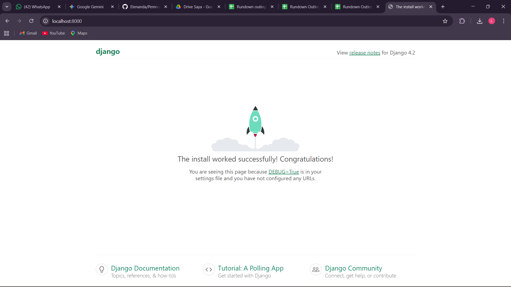
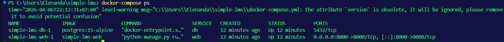
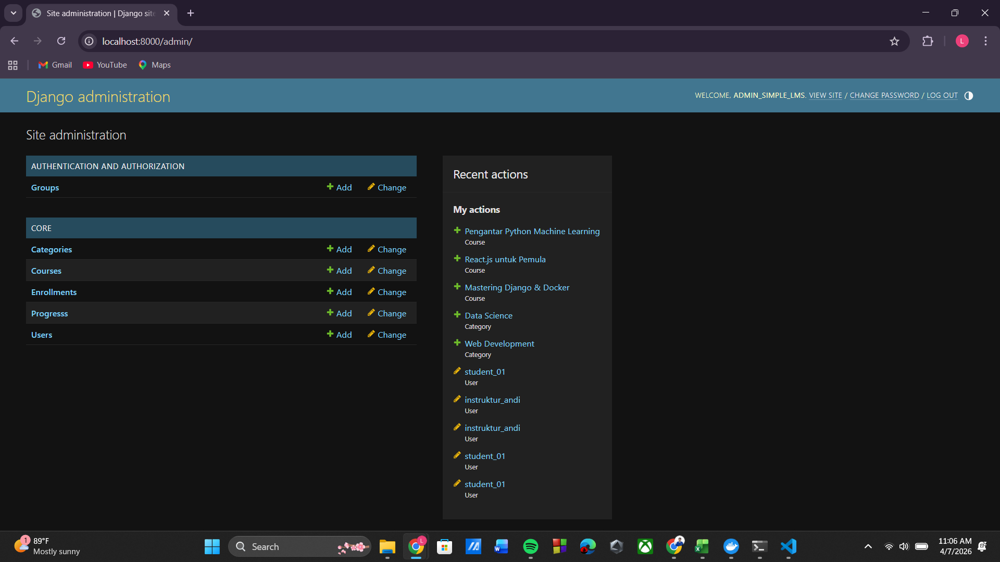
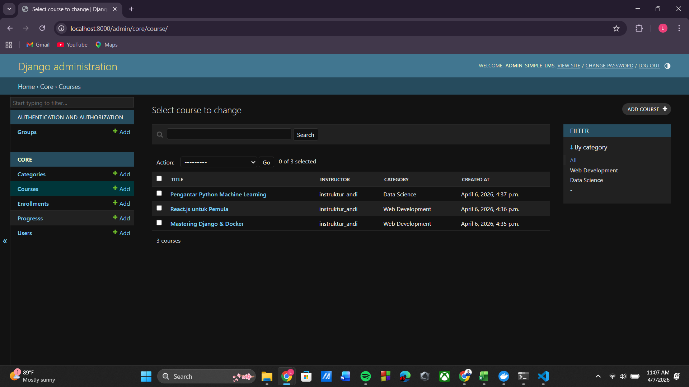
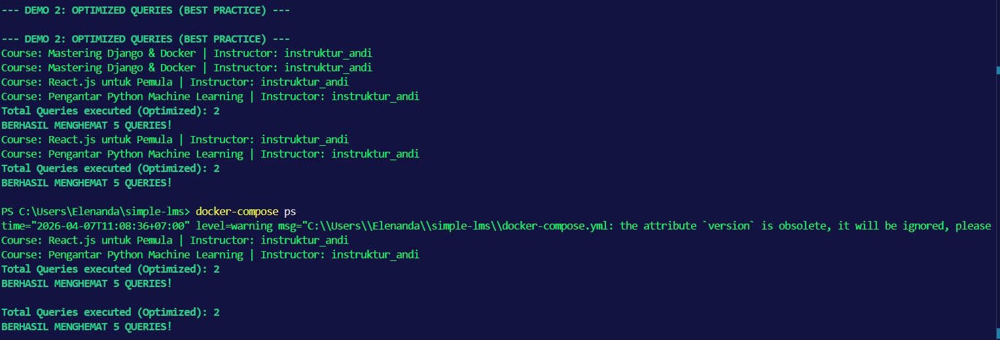
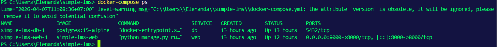

# Simple LMS - Dockerized Django Project

Project ini adalah setup environment development untuk Simple LMS menggunakan Docker, Django, dan PostgreSQL.

## Prasyarat

- Docker Desktop / Docker Engine terinstall
- Git

## Cara Menjalankan Project

1. Clone repository ini.
2. Gandakan file `.env.example` dan ubah namanya menjadi `.env`.
3. Buka terminal di direktori project, lalu jalankan perintah:
   `docker-compose up --build -d`
4. Jalankan migrasi database:
   `docker-compose exec web python manage.py migrate`
5. Buka `http://localhost:8000` di browser.

## Penjelasan Environment Variables

- `SECRET_KEY`: Kunci rahasia untuk keamanan instance Django.
- `DEBUG`: Mode development (True/False).
- `DB_*`: Kredensial untuk melakukan koneksi dari Django (web container) ke PostgreSQL (db container).

## Dokumentasi & Screenshot

### 1. Status Container (Docker PS)

Bukti bahwa ketiga container (web dan db) berjalan dengan baik:


### 2. Halaman Welcome Django

Bukti bahwa Django bisa diakses melalui localhost:8000:


### 3. Log Terminal & Koneksi Database

Bukti bahwa server web berjalan tanpa pesan error dari PostgreSQL:


# 📚 Simple LMS - Data Models & Query Optimization

Project ini adalah implementasi sistem manajemen pembelajaran (Simple LMS) menggunakan **Django**, **PostgreSQL**, dan **Docker**. Fokus utama pada repositori ini adalah desain _database schema_, implementasi ORM, dan optimasi query untuk menyelesaikan permasalahan N+1.

---

### 1. Kelengkapan Models dan Relasi

Telah diimplementasikan 6 model utama dengan relasi yang tepat sesuai spesifikasi:

- **User**: Menggunakan `AbstractUser` dengan penambahan _role_ (`admin`, `instructor`, `student`).
- **Category**: Mengimplementasikan _self-referencing Foreign Key_ untuk hierarki kategori dan sub-kategori.
- **Course**: Berelasi dengan `Instructor` (Foreign Key dengan limitasi _role_) dan `Category`.
- **Lesson**: Berelasi dengan `Course` dan mengimplementasikan `Meta ordering` berdasarkan _field_ `order`.
- **Enrollment**: Berelasi dengan `User` (Student) dan `Course`, dilengkapi dengan `unique_together` constraint agar siswa tidak mendaftar kursus yang sama dua kali.
- **Progress**: Melakukan _tracking_ status `is_completed` untuk setiap _lesson_ yang diambil siswa.

### 2. Query Optimization Implementation

Telah dibuat **Custom Model Managers** di `core/models.py` untuk mencegah pengambilan data yang berulang ke database:

- `Course.objects.for_listing()`: Menggunakan `select_related('category', 'instructor')` dan `prefetch_related('lessons')` untuk optimasi di tampilan daftar kursus.
- `Enrollment.objects.for_student_dashboard()`: Menggunakan `select_related('course', 'course__category')` untuk memuat data pendaftaran beserta detail kursus secara efisien.

### 3. Django Admin Configuration

Antarmuka Django Admin telah dikonfigurasi untuk memudahkan pengelolaan LMS:

- Menambahkan field `role` pada panel modifikasi Custom User.
- Implementasi `list_display`, `list_filter`, dan `search_fields` yang informatif pada setiap model.
- Menggunakan `TabularInline` untuk memungkinkan penambahan dan pengeditan **Lesson** secara langsung di dalam halaman **Course**.

**Screenshots Admin:**



### 4. Migration dan Fixtures

File migrasi awal untuk aplikasi `core` telah dibuat. Data awal (dummy data) untuk pengujian telah di-ekspor dan disimpan di dalam `core/fixtures/initial_data.json`.

### 5. Dokumentasi Query Comparison

Kami membuat _Custom Management Command_ (`demo_queries.py`) untuk mendemonstrasikan perbedaan performa sebelum dan sesudah optimasi.
Berdasarkan pengujian pemanggilan 3 Course dengan relasi Instructor dan Category:

- **Unoptimized Method**: Memerlukan **7 Queries** (N+1 Problem terjadi).
- **Optimized Method**: Hanya memerlukan **2 Queries** (SQL JOIN bekerja dengan baik).
- **Kesimpulan**: Penggunaan `select_related` berhasil menghemat pemanggilan database secara signifikan.

**Bukti Eksekusi Terminal:**


---

## 📸 Dokumentasi Setup Environment Terkait

Selain pengembangan model, environment Docker dan Django dipastikan berjalan dengan stabil:

**1. Halaman Akses Django (Localhost:8000)**


**2. Status Container (Docker Compose)**



**3. Database Logs & Connection**


---

## 🛠️ Cara Menjalankan Project Local

1. **Clone Repository**
   ```bash
   git clone [https://github.com/Elenanda/simple_lms.git](https://github.com/Elenanda/simple_lms.git)
   cd simple_lms
   ```
